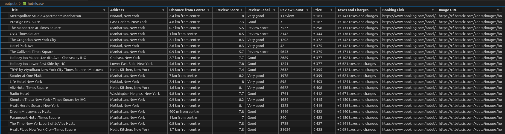

# 🏨 bookingdotcom-scraper

A Selenium-based scraper for extracting hotel listings from [Booking.com](https://www.booking.com) using user-defined filters and settings.  
It supports dynamic page interactions like scrolling and filter selection to capture accurate and customized search results.

---

## 📦 Features

- Search by currency, location, check-in/check-out dates, number of adults and total rooms.
- Filter by star ratings.
- Sort results using Booking.com's sorting options.
- Auto-scroll and click "Load more results" to capture all listings.
- Outputs hotel data in a structured csv format.

---

## 🚀 Getting Started

### 1. Clone the Repository

```bash
git clone https://github.com/your-username/bookingdotcom-scraper.git
cd bookingdotcom-scraper
```

### 2. Set Up Virtual Environment & Install Dependencies

```bash
# Using Python 3.12.9
python3.12 -m venv venv
source venv/bin/activate  # On Windows: venv\Scripts\activate
pip install -r requirements.txt
```

### 3. Configure Environment

Edit the `.env` file with the correct path for your Selenium driver directory and other selection rules:


### 4. Run the Scraper

```bash
python main.py
```

---

## 🛠 Requirements

- Python 3.12.9
- Google Chrome (or compatible browser)
- ChromeDriver or appropriate WebDriver in your system path or specified directory

---

## 📂 Output

Scraped hotel data will be saved in the directory defined by `OUTPUT_DIR_PATH` in your `.env` file.

### Preview


---

## 📄 License

This project is licensed under the MIT License. See the LICENSE file for details.
